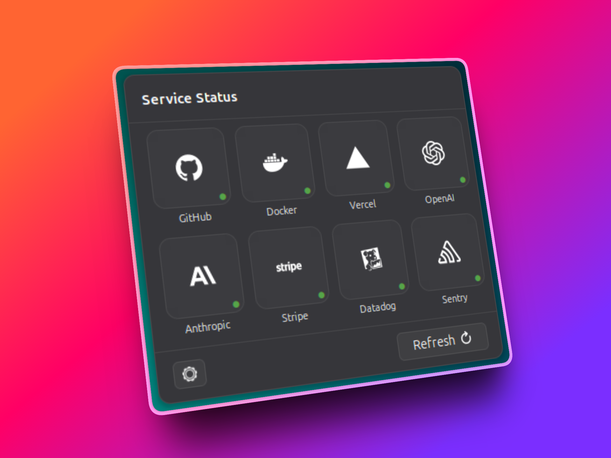

<div align="center">

# StatusDot

**Know when your services break — without opening a dashboard.**

A single colored dot in your GNOME panel shows the health of the services you depend on.  
Click to see which ones are affected and why.

[](https://extensions.gnome.org)
[](LICENSE)
[](eslint.config.js)
[](tests/)

<br>



</div>

---

## Features

- **28 providers** out of the box — GitHub, Vercel, OpenAI, Stripe, and more
- **Grid view** — one icon per service with a status dot at a glance
- **Detail view** — per-service component breakdown and active incidents
- **Notifications** — system alert when a service goes down or recovers (opt-in)
- **Configurable** — enable/disable individual providers, set the refresh interval
- **Direct links** — jump to a provider's status page from the detail view
- No accounts, no telemetry, no background processes beyond the poll timer

## Status colours

| Dot | Meaning |
|-----|---------|
| 🟢 Green | All systems operational |
| 🟡 Yellow | Degraded or partial outage |
| 🔴 Red | Major outage |
| ⚫ Gray | Unknown / fetch error |

The panel dot reflects the **worst** status across all enabled providers.

---

## Installation

### From extensions.gnome.org _(coming soon)_

Search for **StatusDot** and click Install.

### Manual

```bash
git clone https://github.com/enrialonso/statusdot
cd statusdot
make setup    # install npm dependencies (first time only)
make install  # deploy + enable
```

> Requires GNOME Shell 45–50.

---

## Configuration

Open **Settings → Extensions → StatusDot → Preferences**:

| Setting | Description | Default |
|---------|-------------|---------|
| Enable notifications | Notify when a service goes down or recovers | Off |
| Refresh interval | Seconds between status checks | 60 s |
| Providers | Toggle individual services on/off | All on |

---

## Providers

<details>
<summary>28 services across 11 categories</summary>

<br>

| Category | Providers |
|----------|-----------|
| Core dev infrastructure | GitHub, npm, Cloudflare, Docker |
| Code hosting & CI/CD | GitLab, Bitbucket, CircleCI |
| Cloud & deployment | Vercel, Netlify, DigitalOcean |
| AI | OpenAI, Anthropic |
| Databases | MongoDB, Supabase |
| Payments | Stripe |
| Observability | Datadog, Sentry, New Relic |
| Communication | Slack, Discord |
| Developer tools | SendGrid, Postman, Linear, Jira, Figma |
| Docs & collaboration | Confluence, Notion |
| E-commerce | Shopify |

</details>

---

## Development

```bash
make setup      # install npm dependencies
make sync       # deploy changes to GNOME extensions directory
make install    # deploy + enable extension
make run        # launch isolated nested Wayland session for testing
make restart    # uninstall + install + run
make check      # lint + tests (required before packing)
make pack       # build submission ZIP in dist/
make clean      # remove dist/ and node_modules/
```

```bash
npm run lint        # ESLint
npm test            # Vitest unit tests
npm run test:watch  # watch mode
```

Watch extension logs:

```bash
journalctl -f -o cat /usr/bin/gnome-shell 2>&1 | grep StatusDot
```

### Adding a provider

For any service on **Statuspage.io**, add one entry to `src/providers-data.js`:

```js
{
    id:   'example',
    name: 'Example',
    url:  'https://status.example.com/api/v2/summary.json',
    web:  'https://status.example.com',
    icon: 'example-symbolic',   // SVG in src/icons/
}
```
---

## License

MIT — see [LICENSE](LICENSE).
